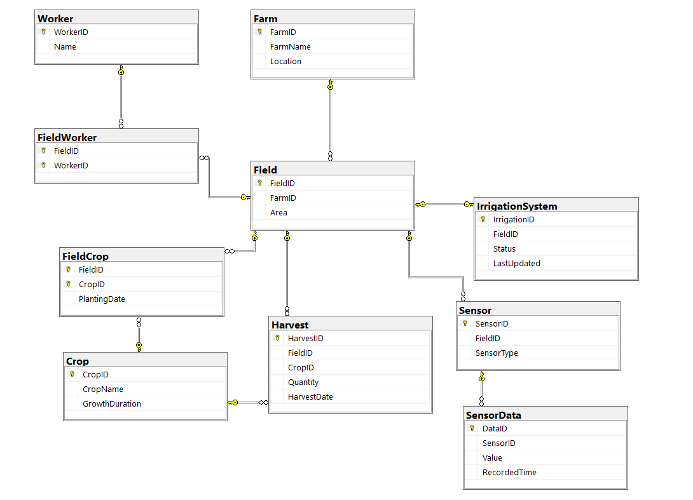

# 🌱 Smart Agriculture Database System

## 📌 Overview
The **Smart Agriculture Database System** is designed to manage and monitor farming operations using structured data. It supports farm management, crop tracking, irrigation systems, sensor monitoring, and worker assignments.

This system helps improve agricultural efficiency by organizing real-time and historical data in a relational database.

---

## 🗂️ ER Diagram

Below is the Entity-Relationship Diagram representing the database structure:




---

## 🗂️ Database Structure

### 1. Farm
- `FarmID` (PK)
- `FarmName`
- `Location`

### 2. Field
- `FieldID` (PK)
- `FarmID` (FK)
- `Area`

### 3. Worker
- `WorkerID` (PK)
- `Name`

### 4. FieldWorker
- `FieldID` (FK)
- `WorkerID` (FK)

### 5. Crop
- `CropID` (PK)
- `CropName`
- `GrowthDuration`

### 6. FieldCrop
- `FieldID` (FK)
- `CropID` (FK)
- `PlantingDate`

### 7. Harvest
- `HarvestID` (PK)
- `FieldID` (FK)
- `CropID` (FK)
- `Quantity`
- `HarvestDate`

### 8. IrrigationSystem
- `IrrigationID` (PK)
- `FieldID` (FK)
- `Status`
- `LastUpdated`

### 9. Sensor
- `SensorID` (PK)
- `FieldID` (FK)
- `SensorType`

### 10. SensorData
- `DataID` (PK)
- `SensorID` (FK)
- `Value`
- `RecordedTime`

---

## 🔗 Relationships

- A Farm has multiple Fields  
- A Field can have multiple Workers (many-to-many)  
- A Field can grow multiple Crops  
- A Field has one Irrigation System  
- A Field contains multiple Sensors  
- A Sensor produces multiple SensorData records  
- Harvest connects Field and Crop with production data  

---

## ⚙️ Features

- Crop lifecycle management (planting → harvesting)  
- Worker assignment system  
- Irrigation monitoring  
- Sensor-based real-time data tracking  
- Historical data storage for analysis  

---

## 🚀 Getting Started

### Prerequisites
- Microsoft SQL Server / SSMS  

### Installation

```bash
git clone https://github.com/mariam010101/smart-agriculture-db.git
